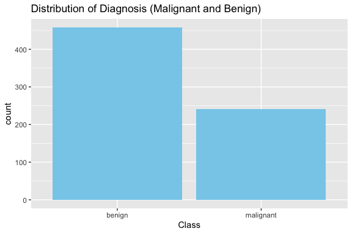
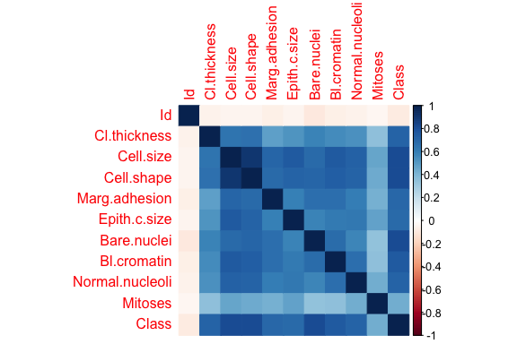
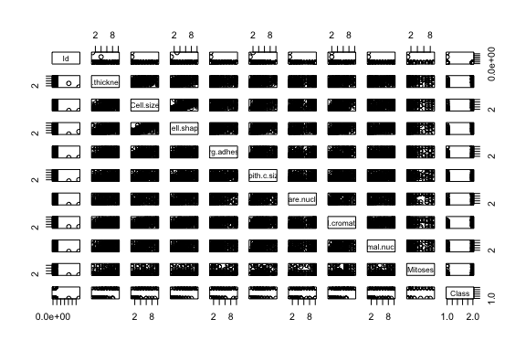

Business Intelligence Lab Submission Markdown
================
Team Marafiki
31/10/2023

- [Student Details](#student-details)
- [Setup Chunk](#setup-chunk)
- [Load the dataset](#load-the-dataset)
- [Exploratory Data anlysis](#exploratory-data-anlysis)
- [Perform clustering](#perform-clustering)

# Student Details

<table>
<colgroup>
<col style="width: 53%" />
<col style="width: 46%" />
</colgroup>
<tbody>
<tr class="odd">
<td><strong>Student ID Numbers and Names of Group Members</strong></td>
<td><ol type="1">
<li><p>136446 - C - Mirav Bhojani</p></li>
<li><p>136788 - C - Derrick Nyaga</p></li>
<li><p>136709 - C - Jane Mugo</p></li>
<li><p>136895 - C - Wesley Wanyama</p></li>
<li><p>135399 - C - Sheilla Kavinya</p></li>
</ol></td>
</tr>
<tr class="even">
<td><strong>GitHub Classroom Group Name</strong></td>
<td><em>Team Marafiki</em></td>
</tr>
<tr class="odd">
<td><strong>Course Code</strong></td>
<td>BBT4206</td>
</tr>
<tr class="even">
<td><strong>Course Name</strong></td>
<td>Business Intelligence II</td>
</tr>
<tr class="odd">
<td><strong>Program</strong></td>
<td>Bachelor of Business Information Technology</td>
</tr>
<tr class="even">
<td><strong>Semester Duration</strong></td>
<td>21<sup>st</sup> August 2023 to 28<sup>th</sup> November 2023</td>
</tr>
</tbody>
</table>

# Setup Chunk

We start by installing all the required packages

``` r
if (require("readr")) {
  require("readr")
} else {
  install.packages("readr", dependencies = TRUE,
                   repos = "https://cloud.r-project.org")
}
```

    ## Loading required package: readr

``` r
## naniar ----
if (require("naniar")) {
  require("naniar")
} else {
  install.packages("naniar", dependencies = TRUE,
                   repos = "https://cloud.r-project.org")
}
```

    ## Loading required package: naniar

``` r
## ggplot2 ----
if (require("ggplot2")) {
  require("ggplot2")
} else {
  install.packages("ggplot2", dependencies = TRUE,
                   repos = "https://cloud.r-project.org")
}
```

    ## Loading required package: ggplot2

``` r
## corrplot ----
if (require("corrplot")) {
  require("corrplot")
} else {
  install.packages("corrplot", dependencies = TRUE,
                   repos = "https://cloud.r-project.org")
}
```

    ## Loading required package: corrplot

    ## corrplot 0.92 loaded

``` r
## ggcorrplot ----
if (require("ggcorrplot")) {
  require("ggcorrplot")
} else {
  install.packages("ggcorrplot", dependencies = TRUE,
                   repos = "https://cloud.r-project.org")
}
```

    ## Loading required package: ggcorrplot

``` r
if (!require("mlbench")) {
  install.packages("mlbench", dependencies = TRUE,
                   repos = "https://cloud.r-project.org")
}
```

    ## Loading required package: mlbench

``` r
library(mlbench)

if (!requireNamespace("GGally", quietly = TRUE)) {
  install.packages("GGally")
}
```

    ## Registered S3 method overwritten by 'GGally':
    ##   method from   
    ##   +.gg   ggplot2

``` r
library(GGally)

if (!requireNamespace("stats", quietly = TRUE)) {
  install.packages("stats")
}
```

------------------------------------------------------------------------

**Note:** the following “*KnitR*” options have been set as the defaults
in this markdown:  
`knitr::opts_chunk$set(echo = TRUE, warning = FALSE, eval = TRUE, collapse = FALSE, tidy.opts = list(width.cutoff = 80), tidy = TRUE)`.

More KnitR options are documented here
<https://bookdown.org/yihui/rmarkdown-cookbook/chunk-options.html> and
here <https://yihui.org/knitr/options/>.

``` r
knitr::opts_chunk$set(
    eval = TRUE,
    echo = TRUE,
    warning = FALSE,
    collapse = FALSE,
    tidy = TRUE
)
```

------------------------------------------------------------------------

**Note:** the following “*R Markdown*” options have been set as the
defaults in this markdown:

> output:  
>   
> github_document:  
> toc: yes  
> toc_depth: 4  
> fig_width: 6  
> fig_height: 4  
> df_print: default  
>   
> editor_options:  
> chunk_output_type: console

# Load the dataset

Load the BreastCancer dataset

``` r
# Load the Breast Cancer dataset
data("BreastCancer")

# View the structure of the dataset
str(BreastCancer)
```

    ## 'data.frame':    699 obs. of  11 variables:
    ##  $ Id             : chr  "1000025" "1002945" "1015425" "1016277" ...
    ##  $ Cl.thickness   : Ord.factor w/ 10 levels "1"<"2"<"3"<"4"<..: 5 5 3 6 4 8 1 2 2 4 ...
    ##  $ Cell.size      : Ord.factor w/ 10 levels "1"<"2"<"3"<"4"<..: 1 4 1 8 1 10 1 1 1 2 ...
    ##  $ Cell.shape     : Ord.factor w/ 10 levels "1"<"2"<"3"<"4"<..: 1 4 1 8 1 10 1 2 1 1 ...
    ##  $ Marg.adhesion  : Ord.factor w/ 10 levels "1"<"2"<"3"<"4"<..: 1 5 1 1 3 8 1 1 1 1 ...
    ##  $ Epith.c.size   : Ord.factor w/ 10 levels "1"<"2"<"3"<"4"<..: 2 7 2 3 2 7 2 2 2 2 ...
    ##  $ Bare.nuclei    : Factor w/ 10 levels "1","2","3","4",..: 1 10 2 4 1 10 10 1 1 1 ...
    ##  $ Bl.cromatin    : Factor w/ 10 levels "1","2","3","4",..: 3 3 3 3 3 9 3 3 1 2 ...
    ##  $ Normal.nucleoli: Factor w/ 10 levels "1","2","3","4",..: 1 2 1 7 1 7 1 1 1 1 ...
    ##  $ Mitoses        : Factor w/ 9 levels "1","2","3","4",..: 1 1 1 1 1 1 1 1 5 1 ...
    ##  $ Class          : Factor w/ 2 levels "benign","malignant": 1 1 1 1 1 2 1 1 1 1 ...

``` r
# Get the dimensions of the dataset (number of rows and columns)
dim(BreastCancer)
```

    ## [1] 699  11

``` r
# View the first few rows of the dataset
head(BreastCancer)
```

    ##        Id Cl.thickness Cell.size Cell.shape Marg.adhesion Epith.c.size
    ## 1 1000025            5         1          1             1            2
    ## 2 1002945            5         4          4             5            7
    ## 3 1015425            3         1          1             1            2
    ## 4 1016277            6         8          8             1            3
    ## 5 1017023            4         1          1             3            2
    ## 6 1017122            8        10         10             8            7
    ##   Bare.nuclei Bl.cromatin Normal.nucleoli Mitoses     Class
    ## 1           1           3               1       1    benign
    ## 2          10           3               2       1    benign
    ## 3           2           3               1       1    benign
    ## 4           4           3               7       1    benign
    ## 5           1           3               1       1    benign
    ## 6          10           9               7       1 malignant

``` r
# Get summary statistics for the dataset
summary(BreastCancer)
```

    ##       Id             Cl.thickness   Cell.size     Cell.shape  Marg.adhesion
    ##  Length:699         1      :145   1      :384   1      :353   1      :407  
    ##  Class :character   5      :130   10     : 67   2      : 59   2      : 58  
    ##  Mode  :character   3      :108   3      : 52   10     : 58   3      : 58  
    ##                     4      : 80   2      : 45   3      : 56   10     : 55  
    ##                     10     : 69   4      : 40   4      : 44   4      : 33  
    ##                     2      : 50   5      : 30   5      : 34   8      : 25  
    ##                     (Other):117   (Other): 81   (Other): 95   (Other): 63  
    ##   Epith.c.size  Bare.nuclei   Bl.cromatin  Normal.nucleoli    Mitoses   
    ##  2      :386   1      :402   2      :166   1      :443     1      :579  
    ##  3      : 72   10     :132   3      :165   10     : 61     2      : 35  
    ##  4      : 48   2      : 30   1      :152   3      : 44     3      : 33  
    ##  1      : 47   5      : 30   7      : 73   2      : 36     10     : 14  
    ##  6      : 41   3      : 28   4      : 40   8      : 24     4      : 12  
    ##  5      : 39   (Other): 61   5      : 34   6      : 22     7      :  9  
    ##  (Other): 66   NA's   : 16   (Other): 69   (Other): 69     (Other): 17  
    ##        Class    
    ##  benign   :458  
    ##  malignant:241  
    ##                 
    ##                 
    ##                 
    ##                 
    ## 

``` r
# Check for missing data in the Breast Cancer dataset Are there missing values
# in the dataset?
any_na(BreastCancer)
```

    ## [1] TRUE

``` r
# How many missing values?
n_miss(BreastCancer)
```

    ## [1] 16

``` r
# What is the proportion of missing data in the entire dataset?
prop_miss(BreastCancer)
```

    ## [1] 0.002080895

``` r
# What is the number and percentage of missing values grouped by each variable?
miss_var_summary(BreastCancer)
```

    ## # A tibble: 11 × 3
    ##    variable        n_miss pct_miss
    ##    <chr>            <int>    <dbl>
    ##  1 Bare.nuclei         16     2.29
    ##  2 Id                   0     0   
    ##  3 Cl.thickness         0     0   
    ##  4 Cell.size            0     0   
    ##  5 Cell.shape           0     0   
    ##  6 Marg.adhesion        0     0   
    ##  7 Epith.c.size         0     0   
    ##  8 Bl.cromatin          0     0   
    ##  9 Normal.nucleoli      0     0   
    ## 10 Mitoses              0     0   
    ## 11 Class                0     0

``` r
# Which variables contain the most missing values?
gg_miss_var(BreastCancer)
```

<!-- -->

``` r
# Which combinations of variables are missing together?
# gg_miss_upset(BreastCancer)

# Where are missing values located (the shaded regions in the plot)?
vis_miss(BreastCancer) + theme(axis.text.x = element_text(angle = 80))
```

<!-- -->

``` r
# Check for missing values in 'Bare.nuclei'
any(is.na(BreastCancer$Bare.nuclei))
```

    ## [1] TRUE

``` r
# Convert 'Bare.nuclei' to numeric (if not already)
BreastCancer$Bare.nuclei <- as.numeric(BreastCancer$Bare.nuclei)

# Impute missing values with the mean of the non-missing values
mean_value <- mean(BreastCancer$Bare.nuclei, na.rm = TRUE)
BreastCancer$Bare.nuclei[is.na(BreastCancer$Bare.nuclei)] <- mean_value

# Check if missing values have been imputed
any(is.na(BreastCancer$Bare.nuclei))
```

    ## [1] FALSE

``` r
# Check the column names of the dataset
colnames(BreastCancer)
```

    ##  [1] "Id"              "Cl.thickness"    "Cell.size"       "Cell.shape"     
    ##  [5] "Marg.adhesion"   "Epith.c.size"    "Bare.nuclei"     "Bl.cromatin"    
    ##  [9] "Normal.nucleoli" "Mitoses"         "Class"

# Exploratory Data analysis

``` r
# Visualize the distribution of the target variable
ggplot(BreastCancer, aes(x = Class)) + geom_bar(fill = "skyblue") + labs(title = "Distribution of Diagnosis (Malignant and Benign)")
```

<!-- -->

``` r
# Identify columns that are not numeric or integer
non_numeric_cols <- sapply(BreastCancer, function(x) !is.numeric(x) && !is.integer(x))

# Convert non-numeric columns to numeric
BreastCancer[, non_numeric_cols] <- lapply(BreastCancer[, non_numeric_cols], as.numeric)

# Compute the correlation matrix
correlation_matrix <- cor(BreastCancer)

# Visualize the correlation matrix
corrplot(correlation_matrix, method = "color")
```

<!-- -->

``` r
# Select only the numeric columns for the scatter plot
numeric_cols <- sapply(BreastCancer, is.numeric)
numeric_data <- BreastCancer[, numeric_cols]

# Create scatter plots
pairs(numeric_data)
```

<!-- -->

``` r
# Select only the numeric columns for standardization
numeric_cols <- sapply(BreastCancer, is.numeric)
numeric_data <- BreastCancer[, numeric_cols]

# Standardize the data
scaled_data <- scale(numeric_data)

# Convert the scaled data back to a data frame
scaled_data <- as.data.frame(scaled_data)

# add the column names back to the scaled_data data frame
colnames(scaled_data) <- colnames(numeric_data)
```

# Perform clustering

``` r
# Specify the number of clusters you want to create (e.g., 2 for benign and
# malignant)
num_clusters <- 2

# Perform K-Means clustering
kmeans_result <- kmeans(scaled_data, centers = num_clusters)

# Add the cluster assignments to your original dataset
BreastCancer$cluster <- kmeans_result$cluster

# The 'cluster' column in 'BreastCancer' now contains the cluster assignments

# view the cluster centers using:
kmeans_result$centers
```

    ##            Id Cl.thickness  Cell.size Cell.shape Marg.adhesion Epith.c.size
    ## 1  0.06156351   -0.5213789 -0.6141599 -0.6117079    -0.5216751   -0.5205101
    ## 2 -0.11625837    0.9845875  1.1597979  1.1551674     0.9851468    0.9829468
    ##   Bare.nuclei Bl.cromatin Normal.nucleoli    Mitoses      Class
    ## 1  -0.6059197   -0.563620      -0.5339962 -0.3123390 -0.6880737
    ## 2   1.1442369    1.064357       1.0084143  0.5898302  1.2993788

``` r
# To visualize the clusters we use scatter plot
ggplot(BreastCancer, aes(x = Cl.thickness, y = Cell.size, color = factor(cluster))) +
    geom_point() + labs(title = "K-Means Clustering of Breast Cancer Data")
```

<!-- -->

``` r
# Calculate the total within-cluster variance for different numbers of clusters
wcss <- numeric(length = 10)  # Initialize a vector to store within-cluster variance

for (i in 1:10) {
    kmeans_model <- kmeans(scaled_data, centers = i)
    wcss[i] <- kmeans_model$tot.withinss
}

wcss <- numeric(length = 10)  # Initialize a vector to store within-cluster variance

# Create a scree plot to identify the optimal number of clusters
plot(1:10, wcss, type = "b", xlab = "Number of Clusters", ylab = "Total Within-Cluster Variance",
    main = "Scree Plot")
```

<!-- -->

``` r
# After identifying the elbow point, you can choose the optimal number of
# clusters.  For example, if the elbow point is at k=3, you can perform K-Means
# clustering with 3 clusters.
optimal_clusters <- 3  # Replace with the actual optimal number of clusters

# Perform K-Means clustering with the optimal number of clusters
kmeans_result <- kmeans(scaled_data, centers = optimal_clusters)

# Add the cluster assignments to your original dataset
BreastCancer$cluster <- kmeans_result$cluster

# view the cluster centers using:
kmeans_result$centers
```

    ##           Id Cl.thickness  Cell.size Cell.shape Marg.adhesion Epith.c.size
    ## 1 -0.6953766   -0.6747363 -0.6321961 -0.6255988    -0.5358592   -0.3999755
    ## 2  0.3072948   -0.4715933 -0.6083047 -0.6071984    -0.5170704   -0.5596402
    ## 3 -0.1162584    0.9845875  1.1597979  1.1551674     0.9851468    0.9829468
    ##   Bare.nuclei Bl.cromatin Normal.nucleoli    Mitoses      Class
    ## 1  -0.5832273  -0.5896446      -0.4915066 -0.2688329 -0.6873343
    ## 2  -0.6132866  -0.5551715      -0.5477899 -0.3264627 -0.6883137
    ## 3   1.1442369   1.0643568       1.0084143  0.5898302  1.2993788

``` r
# To visualize the clusters, you can create a scatter plot using a subset of
# the variables (e.g., 'Cl.thickness' and 'Cell.size')
library(ggplot2)
ggplot(BreastCancer, aes(x = Cl.thickness, y = Cell.size, color = factor(cluster))) +
    geom_point() + labs(title = "K-Means Clustering of Breast Cancer Data")
```

<!-- -->
